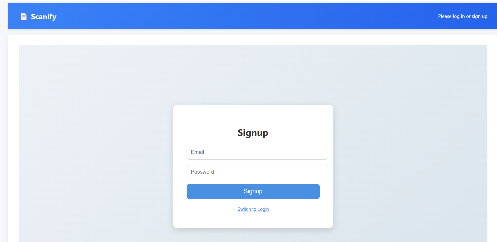
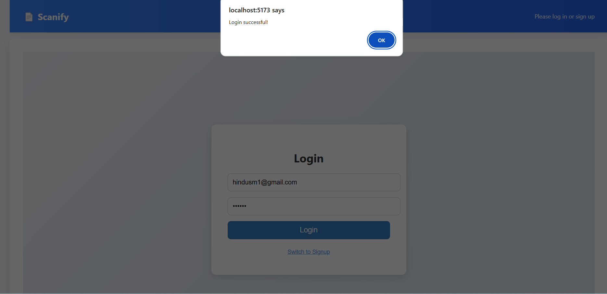
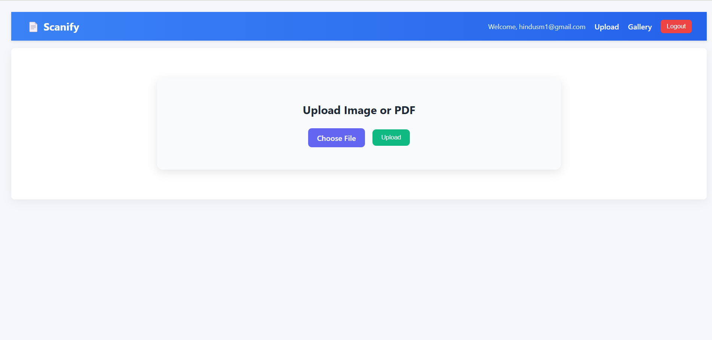
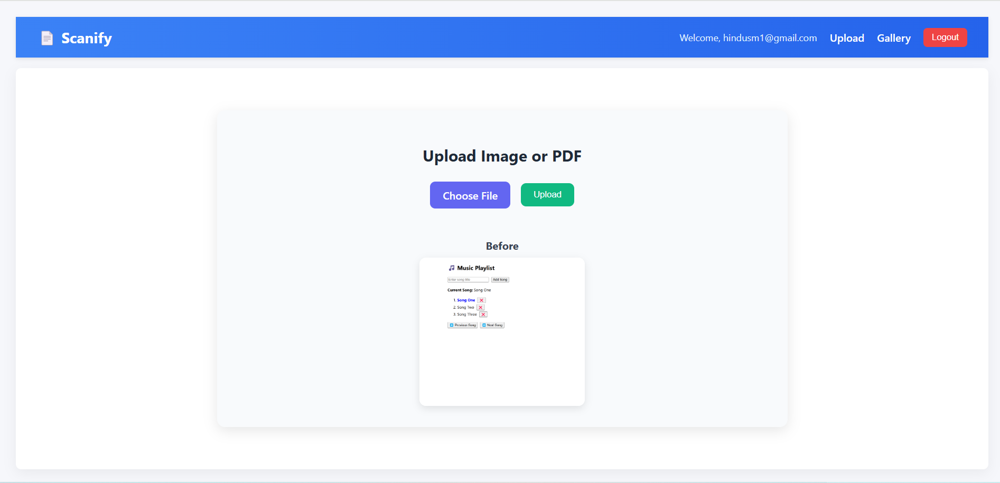
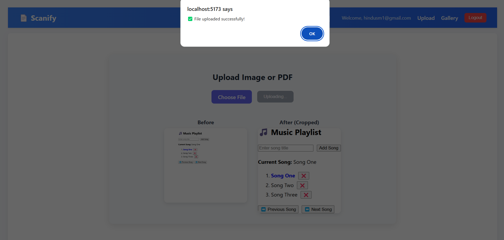
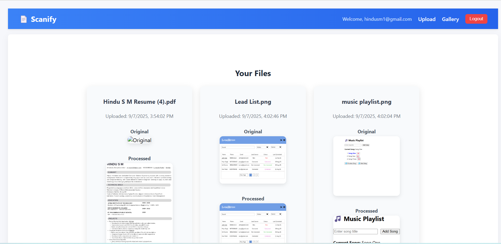
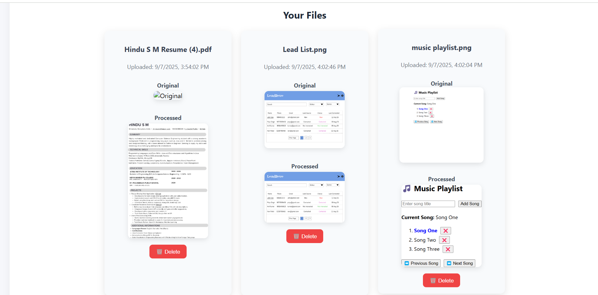

# 📄 Scanify – Lightweight Document Scanner (React + Firebase)

**Public app URL**: [https://scanify-7c308.web.app](https://scanify-7c308.web.app)

---

## 🔹 Architecture Overview & Data Flow

- **Frontend (React + Vite)**  
  Handles authentication, file uploads, preview, gallery, and UI.

- **Firebase Authentication**  
  Provides user login and secure access.

- **Firebase Firestore**  
  Stores file metadata (URLs, paths, timestamps, user ID).

- **Firebase Storage**  
  Stores uploaded original documents and processed (cropped) versions.

### Data Flow

1. User uploads a file → stored in **Firebase Storage**.  
2. Download URLs + storage paths are saved in **Firestore**.  
3. **Gallery** listens to Firestore in real-time and renders previews.  
4. Deleting a file removes both the **Storage objects** and **Firestore metadata**.  

---

## 🔹 Auto-Crop Algorithm

1. Convert uploaded image to **grayscale**  
2. Apply **Gaussian blur** to reduce noise  
3. Detect edges using **Canny edge detection**  
4. Find **contours** and approximate to a polygon  
5. Select the **largest quadrilateral** (likely the document)  
6. Apply **perspective transform** to crop and flatten  
7. Return **processed image** for preview and saving  

---

✨ **Features**

- **Auth**: Email/password (Firebase Auth)
- **Upload**: PNG/JPEG; **PDF → image** via `pdf.js` (first page)
- **Auto-Crop**: Simple background-trim that approximates a scanner crop
- **Before/After**: Side-by-side preview
- **Persistence**: Saves processed image (base64) + metadata in Firestore
- **Gallery**: Lists previous uploads for the signed-in user
- **Security**: Per-user isolation via Firestore rules
- **No Storage Required**: Uses Firestore only (for small files)

> ⚠️ **Note:** This demo stores images as base64 strings in Firestore for convenience. This is fine for *small* images but is **not** recommended for production or large files. Use Firebase **Storage** for real projects.

---

 🧱 **Tech Stack**

- Frontend: React (Vite)
- PDF: `pdfjs-dist` (legacy build)
- Auth & DB: Firebase Auth + Firestore
- Styling: Vanilla CSS modules (lightweight)
- OpenCV.js for advanced edge detection/perspective warp (can be added later).

---

## 🔹 Setup Instructions

1. **Clone & install**
   
git clone https://github.com/hindu17/Scanify.git

cd docscanner

npm install

2. **Firebase Setup**

- Create a Firebase project
- Enable Authentication, Firestore, Storage, Hosting
- Copy your Firebase config into firebaseConfig.js

3. **Run locally**

npm run dev

4. **Build & Deploy (Firebase Hosting)**

npm run build

firebase init hosting

firebase deploy

---

🔹 **Libraries Used**

- React + Vite – MIT License  
- Firebase JS SDK – Apache 2.0 License  
- OpenCV.js (for auto-crop) – Apache 2.0 License  
- UUID (for unique file names) – MIT License  

All dependencies are open-source and free to use in this project.

---

🔹 **Trade-Offs & Improvements**

• **Current trade-offs**

   - Auto-crop runs client-side → can be slow for large images.
   - Storage cost grows with both original + processed files.
   - Simple authentication (no roles/permissions).

• **Next improvements**

   - Add bulk upload + batch processing.
   - Use Cloud Functions for server-side image processing.
   - Improve edge detection with ML-based document boundary detection.
   - Add PDF export & multi-page scanning.

**Screenshots**

